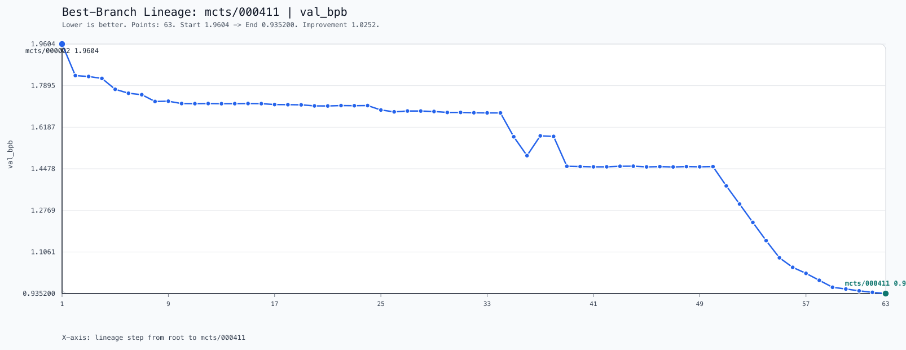

# Parameter Golf Example

This example applies ResearchTree to OpenAI's Parameter Golf challenge.

The working idea is simple: keep a baseline implementation in [`src/`](./src/), use TreeGit to produce descendants, and score those descendants with a repeatable local proxy before deciding which branches deserve more search.

If you want the baseline source context, start with [`./src/README.md`](./src/README.md). This README focuses on the example harness around it.

## Goal

The goal of this example is to make iterative model-search practical:

- baseline code lives in one stable place
- candidate edits are made in isolated worktrees
- every candidate is evaluated with the same scoring logic
- artifacts are kept in predictable locations for later comparison

## Layout

- `score.py`: train-and-score entrypoint for a candidate repo or TreeGit worktree
- `src/`: baseline source used as the TreeGit root
- `data/`: local cached FineWeb download helper and downloaded tokenizer/dataset artifacts
- `objectives/parameter_golf_objective.py`: JSON objective wrapper used by TreeGit
- `mcts/smoke.json`: cheaper search config for wiring checks
- `mcts/real.json`: longer-running search config
- `mcts/prompt.md`: agent prompt used for worktree expansion
- `skills/`: helper skills that were used while exploring this example
- `test_runs/`: preserved sample outputs from earlier local runs
- `plot.png` and `search-tree.svg`: example result visualizations

## Requirements

- Linux
- `pixi`
- the root repo cloned with the `treegit` submodule
- FineWeb data and tokenizer assets under `./data/`, or explicit `--data-path` and `--tokenizer-path` overrides

## Quick Start

Set up the example environment and local data cache:

```bash
cd examples/parameter_golf
pixi install
pixi run download-data
```

Run a cheap score pass against the baseline:

```bash
cd examples/parameter_golf
pixi run python score.py ./src \
  --run-id baseline_smoke \
  --env ITERATIONS=2 \
  --env WARMUP_STEPS=0 \
  --env WARMDOWN_ITERS=0 \
  --env MAX_WALLCLOCK_SECONDS=60 \
  --env TRAIN_BATCH_TOKENS=8192 \
  --env VAL_LOSS_EVERY=0 \
  --env TRAIN_LOG_EVERY=1 \
  --env MUON_BACKEND_STEPS=1
```

Or score an existing run log:

```bash
cd examples/parameter_golf
pixi run python score.py ./src \
  --log-file ./test_runs/test_20260322_233131/logs/test_20260322_233131.txt
```

The objective wrapper is what TreeGit uses during search:

```bash
cd examples/parameter_golf
pixi run python objectives/parameter_golf_objective.py ./src \
  --objective-version manual-smoke \
  --output-root ./artifacts/manual-smoke \
  --env ITERATIONS=2 \
  --env WARMUP_STEPS=0 \
  --env WARMDOWN_ITERS=0 \
  --env MAX_WALLCLOCK_SECONDS=60
```

## TreeGit Wiring

Run TreeGit from inside `src/` and point it at the configs in this directory:

```bash
cd examples/parameter_golf/src
python3 ../../../treegit/src/treegit/cli.py init
python3 ../../../treegit/src/treegit/cli.py commit -m "baseline snapshot"
python3 ../../../treegit/src/treegit/cli.py mcts init --config ../mcts/smoke.json
```

The checked-in configs assume:

- candidate worktrees are created under `examples/parameter_golf/worktrees/` or `examples/parameter_golf/smoke-worktrees/`
- run artifacts are written under `examples/parameter_golf/artifacts/` or `examples/parameter_golf/smoke-artifacts/`
- the local dataset cache lives at `examples/parameter_golf/data/`

## How Scoring Works

`score.py` supports two modes:

- run mode: launches `torchrun` via this directory's `pixi.toml`, then parses the produced log
- score-only mode: parses an existing log with `--log-file`

When launching training, the scorer:

- treats the positional argument as the candidate repo root
- defaults the train script to `<repo_root>/train_gpt.py`
- first checks `<repo_root>/data/`, then falls back to this example's `data/`
- writes run outputs under `<repo_root>/score_runs/` unless you override `--output-root` or `--run-dir`

The final score is a weighted sum of `val_bpb`, `val_loss`, and total submission size in bytes, with hard penalties if the submission exceeds the artifact or line caps. Lower is better.

## Example Search Result

This plot shows one best-branch lineage improving `val_bpb` over 63 search steps, from `1.9604` down to `0.9352`.


